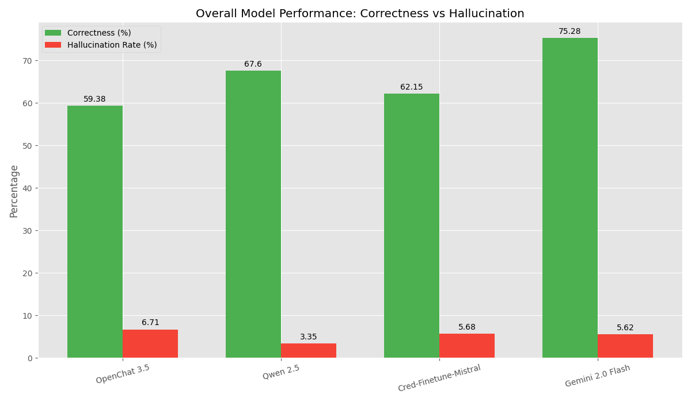
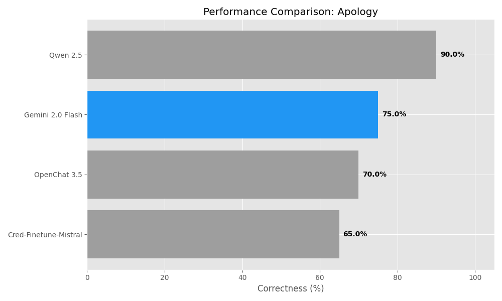
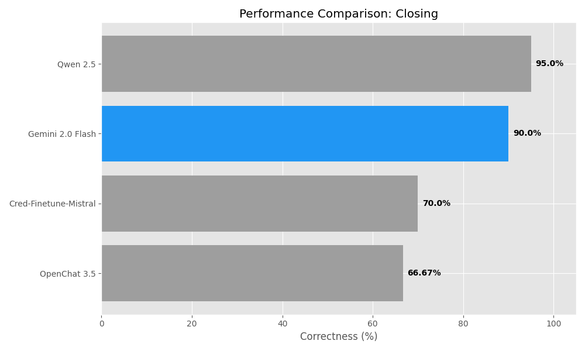
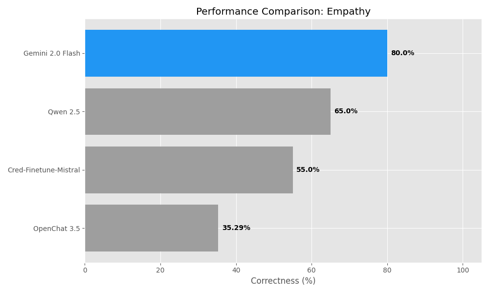
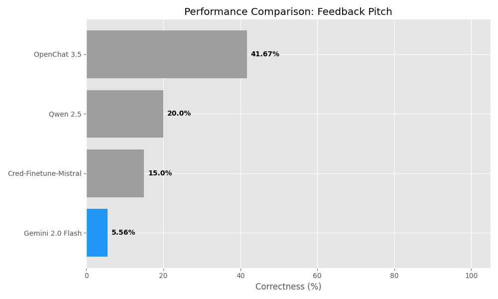
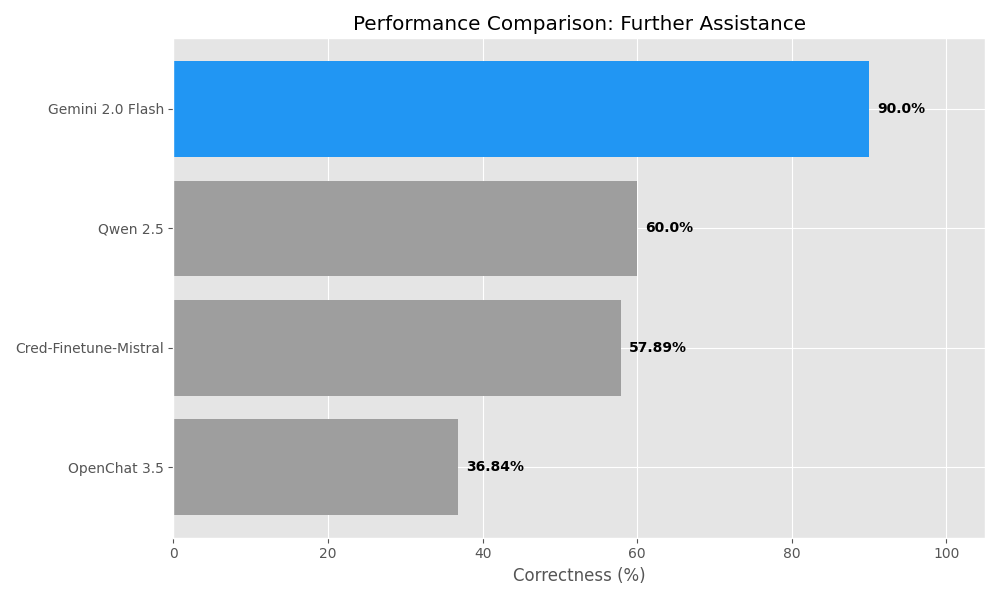
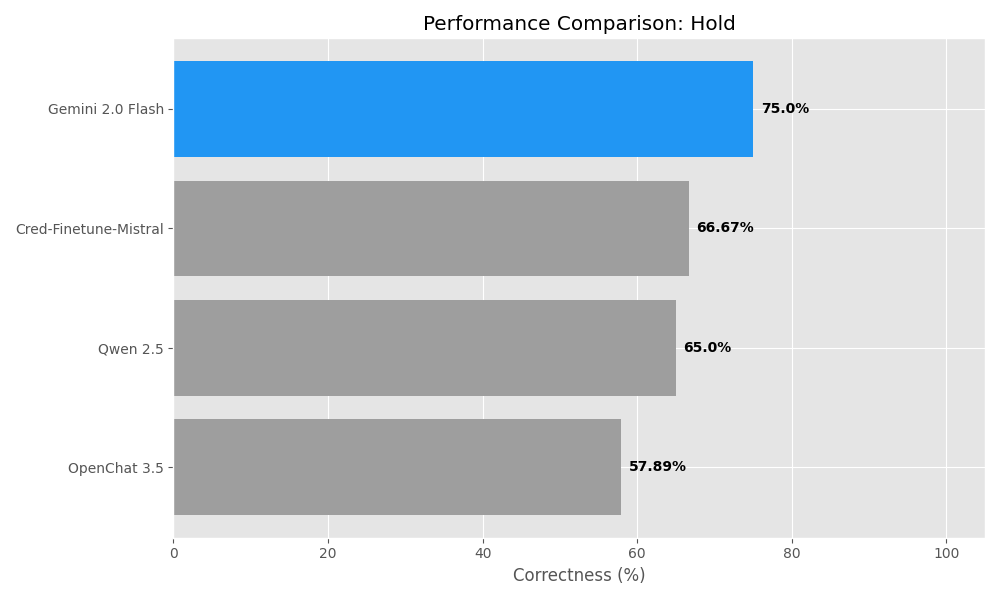
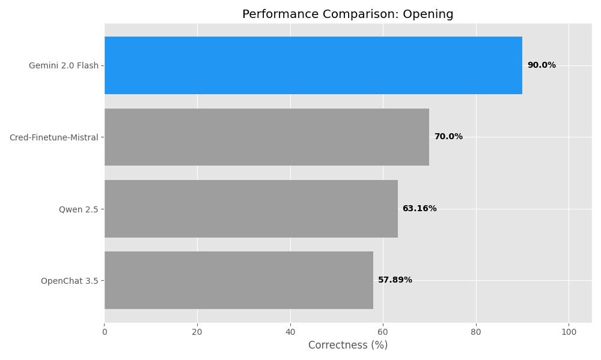
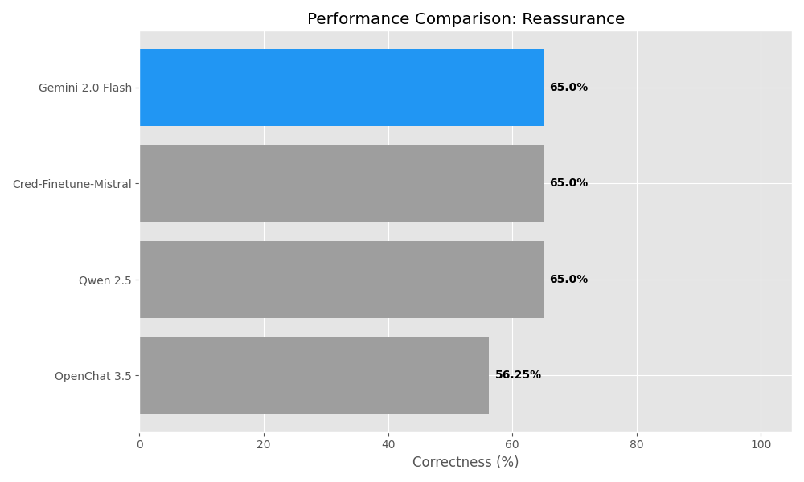
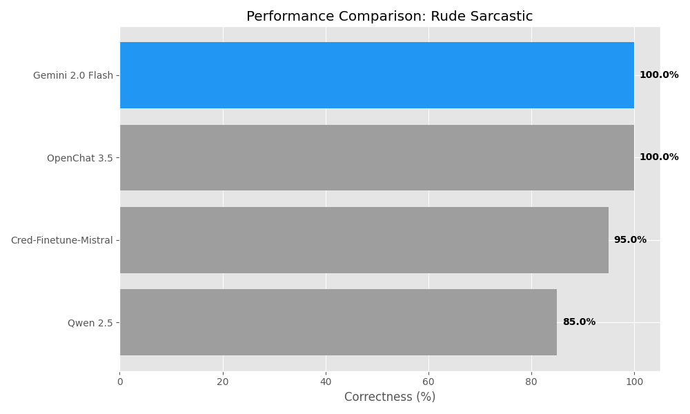

# Final Analytics Presentation Report

## 1. Executive Summary

**Recommendation: Adoption of Gemini 2.0 Flash**

Based on the quantitative analysis of 20 validated conversations, **Gemini 2.0 Flash** is the clear recommendation for production deployment, offering the highest evidence correctness (75.28%) and a competitive hallucination rate. While **Qwen 2.5** offers a slightly lower hallucination rate, Gemini's superior ability to correctly identify and evaluate customer support guidelines outweighs the small margin in safety, which can be mitigated with guardrails.

### Key Metrics
| Model | Evidence Correctness | Hallucination Rate |
|-------|----------------------|-------------------|
| **Gemini 2.0 Flash** | **75.28%** (Best) | 5.62% |
| Qwen 2.5 | 67.60% | **3.35%** (Best) |
| Cred-Finetune-Mistral | 62.15% | 5.68% |
| OpenChat 3.5 | 59.38% | 6.71% |

---

## 2. Visual Performance Analysis

### Overall Model Comparison
The chart below illustrates the trade-off between correctness and safety (hallucination). Gemini 2.0 Flash leads significantly in correctness.

---

## 3. Guideline-Specific Performance

The following charts compare all models across each specific guideline.

### Apology

### Closing

### Empathy

### Feedback Pitch

### Further Assistance

### Hold

### Opening

### Reassurance

### Rude/Sarcastic

---

## 4. Recommendation vs Open Source Alternatives

### Comparison Candidate: Qwen 2.5
Qwen 2.5 is the strongest open-source contender.

- **Pros of Qwen 2.5**:
    - Lowest Hallucination Rate (3.35%).
    - Strong performance in **apology** and **closing**.
- **Cons of Qwen 2.5**:
    - Significantly lower overall correctness (67.6%) vs Gemini (75.3%).
    - Weaker in **empathy** and **opening** guidelines.

