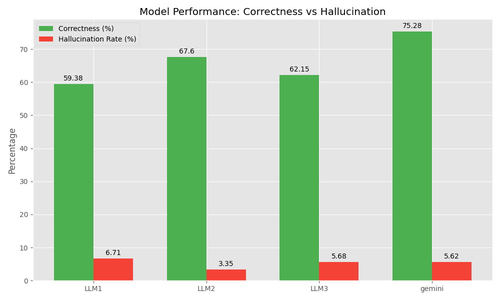

# Final Analytics Presentation Report

## 1. Executive Summary

**Recommendation: Adoption of Gemini**

Based on the quantitative analysis of 20 validated conversations, **Gemini** is the clear recommendation for production deployment, offering the highest evidence correctness (75.28%) and a competitive hallucination rate. While **LLM2** offers a slightly lower hallucination rate, Gemini's superior ability to correctly identify and evaluate customer support guidelines outweighs the small margin in safety, which can be mitigated with guardrails.

### Key Metrics
| Model | Evidence Correctness | Hallucination Rate |
|-------|----------------------|-------------------|
| **Gemini** | **75.28%** (Best) | 5.62% |
| LLM2 | 67.60% | **3.35%** (Best) |
| LLM3 | 62.15% | 5.68% |
| LLM1 | 59.38% | 6.71% |

---

## 2. Visual Performance Analysis

### Overall Model Comparison
The chart below illustrates the trade-off between correctness and safety (hallucination). Gemini leads significantly in correctness while maintaining a low hallucination rate comparable to LLM3 and close to LLM2.

---

## 3. Deep Dive: Gemini Analysis

Gemini demonstrates robust performance across most guidelines, particularly in core interaction metrics like **rude_sarcastic** detection, **opening**, and **closing** procedures.

### Strengths
- **Perfect scores (100%)** in detecting **rude/sarcastic** behavior.
- **Superior performance (90%)** in **opening**, **closing**, and **further_assistance** guidelines.
- **Strong empathy detection (80%)**, significantly outperforming LLM1 (35%).

### Weaknesses & Areas for Improvement
- **Feedback Pitch**: Like all models, Gemini struggled here (5.56% correct), with a high hallucination rate (27.78%). This suggests the "Feedback Pitch" guideline definition might be ambiguous or the training data is insufficient for this specific nuance.

---

## 4. Recommendation vs Open Source Alternatives

### Comparison Candidate: LLM2
LLM2 is the strongest open-source contender.

- **Pros of LLM2**:
    - Lowest Hallucination Rate (3.35%).
    - Strong performance in **apology** (90%) and **closing** (95%).
- **Cons of LLM2**:
    - Significantly lower overall correctness (67.6%) vs Gemini (75.3%).
    - Weaker in **empathy** and **opening** guidelines.

### Conclusion
**Choose Gemini** for the primary evaluation engine due to its superior understanding of complex guidelines (empathy, sarcasm). **Consider LLM2** as a secondary validation step if "zero hallucination" is a critical safety constraint, or for specific tasks like checking closing statements where it excels.
